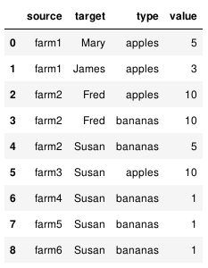
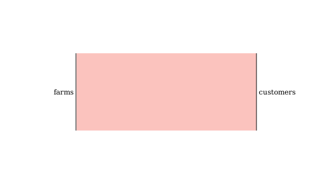
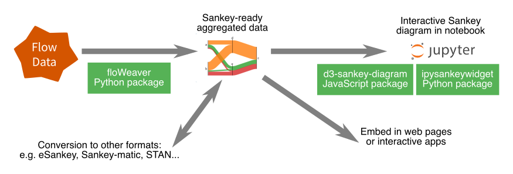

|

.. image:: https://badge.fury.io/py/floweaver.svg
    :target: https://badge.fury.io/py/floweaver
    :alt: PyPI Status
.. image:: https://readthedocs.org/projects/floweaver/badge/?version=latest
    :target: http://floweaver.readthedocs.io/en/latest/?badge=latest
    :alt: Documentation Status
.. image:: https://travis-ci.org/ricklupton/floweaver.svg?branch=master
    :target: https://travis-ci.org/ricklupton/floweaver
    :alt: Test Status
.. image:: https://codecov.io/gh/ricklupton/floweaver/branch/master/graph/badge.svg
    :target: https://codecov.io/gh/ricklupton/floweaver
    :alt: Coverage Status
.. image:: https://zenodo.org/badge/DOI/10.5281/zenodo.161970.svg
    :target: https://doi.org/10.5281/zenodo.596249
    :alt: DOI

by `Rick Lupton <http://www.ricklupton.name>`_ and `Contributors`_
      
Many kinds of data can be thought of as 'flows': energy and materials moving
through industry, money flowing through the economy, telephone lines moving
between providers, voters moving between parties. **floWeaver** helps you to
exchange and analyse flow data and visualise it using `Sankey diagrams
<https://en.wikipedia.org/wiki/Sankey_diagram>`_.

For example, here is some data on flows of fruit from farms to customers:

With floWeaver you can **visualise** this as a variety of **Sankey diagrams**
depending on what you want to show:

Although there are a variety of tools for working with flow data and Sankey
diagrams in particular contexts, there are no open data formats for sharing data
between tools and domains. We aim to provide a **common data format and data converters** 
to support interoperability and open data.

You are free to copy, modify, and distribute floWeaver with attribution
under the terms of the MIT license. See the `LICENSE <LICENSE>`_ file
for details. If you find it useful please acknowledge that by citing floWeaver 
(`see below <#citing-floweaver>`_).

Get started using floWeaver
---------------------------

floWeaver is a Python package, but you can successfully use it as a data analysis
tool even without too much familiarity with Python. The best way to get started is
to use it in a `Jupyter notebook <http://jupyter.org/>`_ (more advanced users can
use it outside the notebook environment to export JSON/SVG but this is still
under development; see `this comment
<https://github.com/ricklupton/floweaver/issues/34#issuecomment-385040059>`_).

🚀 **Try floWeaver online with no installation:** `Quickstart tutorial on Binder
<https://mybinder.org/v2/gh/ricklupton/floweaver/master?filepath=docs%2Ftutorials%2Fquickstart.ipynb>`_.

To install floWeaver locally, you need Python 3 installed (you might want to install it 
using `Anaconda or Miniconda <https://www.continuum.io/downloads>`_); see the `installation page
<https://floweaver.readthedocs.io/en/latest/installation.html>`_ for full details.

Installation using conda
________________________

You can install floweaver using conda:

.. code-block:: console

   conda install -c conda-forge floweaver

You likely also want `ipysankeywidget <https://github.com/ricklupton/ipysankeywidget>`_ to show Sankey
diagrams in the Jupyter notebook. Install it using conda:

.. code-block:: console

   conda install -c conda-forge ipysankeywidget
   
(that's it — the jupyter nbextensions are enabled automatically when using conda)
   
Installation using pip
______________________

Alternatively, you can install floweaver using pip:

.. code-block:: console

   pip install floweaver

You likely also want `ipysankeywidget <https://github.com/ricklupton/ipysankeywidget>`_ to show Sankey
diagrams in the Jupyter notebook. Install this using pip and enable:

.. code-block:: console

   pip install ipysankeywidget
   jupyter nbextension enable --py --sys-prefix ipysankeywidget
   
ipywidgets also needs to be enabled. You might have already done this, but missing it out is a
common cause of problems so it doesn't hurt to do it again!

.. code-block:: console

   jupyter nbextension enable --py --sys-prefix widgetsnbextension

Quickstart tutorial
___________________

To get started, open the `quickstart tutorial <docs/tutorials/quickstart.ipynb>`_ in
Jupyter notebook and step through the notebook cells to produce the fruit example shown above.

Find out more 📖
________________

`Tutorials, cookbook examples, and API documentation are all available on ReadTheDocs
<https://floweaver.readthedocs.io/en/latest/>`_

If you have a question that isn't answered please `open an issue on GitHub
<https://github.com/ricklupton/floweaver/issues>`_, if there isn't one there already. You can
also use the `Gitter chatroom <https://gitter.im/floweaver/Lobby>`_ for discussion and questions.

Contributing 🎁
---------------

Thanks for your interest in contributing! There are many ways to contribute to floWeaver: 
sharing examples of work done using it, suggestions for improving the documentation, examples
of things that are more difficult than they should be or don't work, as well as actual fixes to
code and documentation. To get started see `CONTRIBUTING.md <CONTRIBUTING.md>`_ and our `code of
conduct <CODE_OF_CONDUCT.md>`_.

We have a `detailed Roadmap <https://github.com/ricklupton/floweaver/projects/2>`_ showing what we
are working on up to May 2018; beyond that there is the `longer-term Roadmap <https://github.com/ricklupton/floweaver/projects/1>`_. We also have `good first issues grouped by type of contribution <https://github.com/ricklupton/floweaver/projects/3>`_.

How does it work?
-----------------

floWeaver builds on the approach described in the paper `Hybrid Sankey diagrams:
Visual analysis of multidimensional data for understanding resource use
<https://doi.org/10.1016/j.resconrec.2017.05.002>`_. It uses `ipysankeywidget 
<https://github.com/ricklupton/ipysankeywidget>`_ and `d3-sankey-diagram 
<https://github.com/ricklupton/d3-sankey-diagram>`_ for actually drawing the Sankey
diagrams.

Citing floWeaver
----------------

If floweaver has been significant in a project that leads to a publication, please
acknowledge that by citing the paper linked above:

   R. C. Lupton and J. M. Allwood, ‘Hybrid Sankey diagrams: Visual analysis of multidimensional
   data for understanding resource use’, Resources, Conservation and Recycling, vol. 124, pp.
   141–151, Sep. 2017. DOI: 10.1016/j.resconrec.2017.05.002

and/or citing the software itself; you can `get a citation of the latest version from Zenodo 
<https://doi.org/10.5281/zenodo.596249>`_.

Contributors
------------

- Leo Paoli (documentation)
- Konstantin Stadler (issues & use in IOA)
- Dhanuka Lakshan
- Andreas Fehlner
- Elliott Sales de Andrade
- @abmakko (the logo)
- Chris Barnes (@clbarnes)
