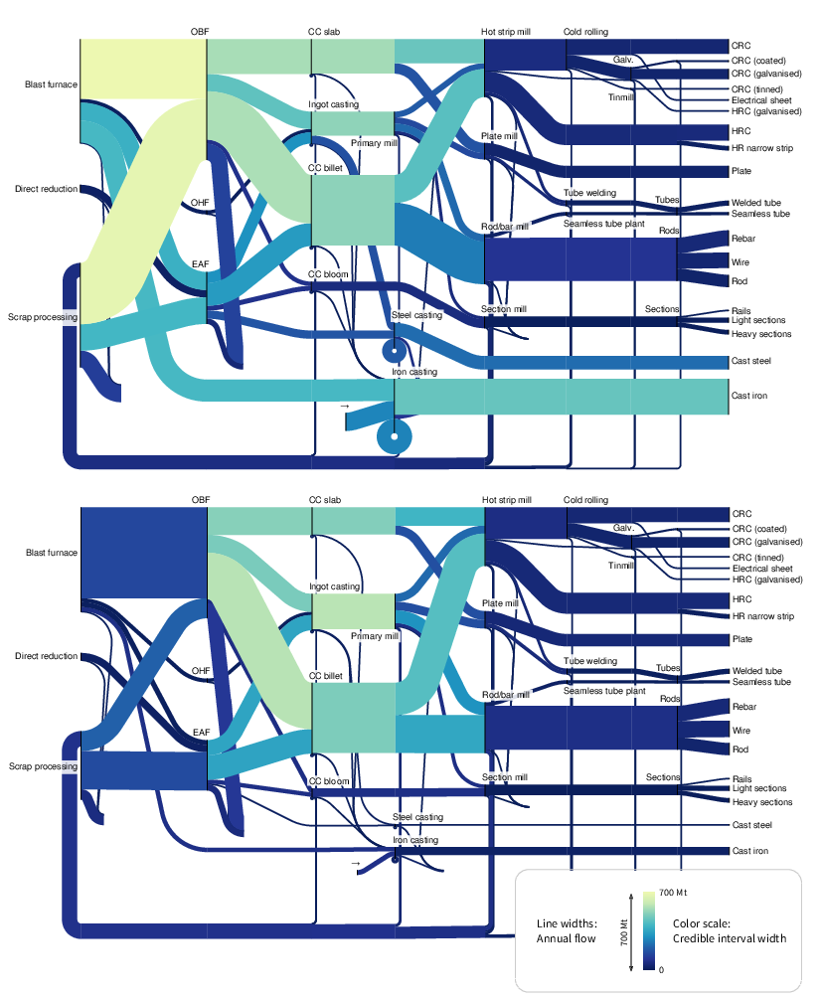

Journal article: Incremental Material Flow Analysis with Bayesian Inference
===========================================================================

`This article <http://dx.doi.org/10.1111/jiec.12698>`_ uses Sankey diagrams to
visualise the results of an uncertain Material Flow Analysis. floWeaver was used
to structure the diagrams and calculate the colours, which indicate the level of
uncertainty about each flow.

The floWeaver code to produce this diagram is `available on Github
<https://github.com/ricklupton/bayesian-mfa-paper/blob/master/2%20-%20View%20results.ipynb>`_.
Note that this used an older version of floWeaver, where some details of the API
for overriding flow colours were different.

- **Source**: R Lupton & J Allwood, Incremental Material Flow Analysis with
  Bayesian Inference. Journal of Industrial Ecology (2017). DOI:
  `10.1111/jiec.12698 <http://dx.doi.org/10.1111/jiec.12698>`_.

