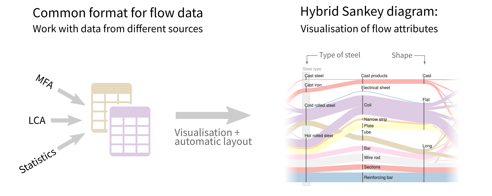

.. Sankey-view documentation master file, created by
   sphinx-quickstart on Wed Nov 15 20:55:44 2017.
   You can adapt this file completely to your liking, but it should at least
   contain the root `toctree` directive.

Welcome to floweaver's documentation!
=======================================

floWeaver generates Sankey diagrams from a dataset of flows. For a descriptive
introduction, see the paper `Hybrid Sankey diagrams: Visual analysis of
multidimensional data for understanding resource use
<https://doi.org/10.1016/j.resconrec.2017.05.002>`_. For a more hands-on
introduction, read on.

Getting started
---------------

.. note::

   You can try the tutorials online without installing anything! `Click here to
   open MyBinder
   <https://mybinder.org/v2/gh/ricklupton/floweaver/master?filepath=docs%2Ftutorials%2Findex.ipynb>`_.

Start by installing floWeaver:

.. toctree::
   :titlesonly:

   installation
   changes
   migrating-sankeyview-to-floweaver

Then the tutorials introduce the concepts used to generate and manipulate Sankey
diagrams:

.. toctree::
   :titlesonly:

   tutorials/quickstart
   tutorials/dimension-tables
   tutorials/system-boundary
   tutorials/colour-scales

Real-world examples!
--------------------

The examples gallery has real-world examples of how floWeaver has been used.

.. toctree::
   :titlesonly:
   :maxdepth: 1

   gallery/index

Cookbook
--------

Shorter examples of how to do common tasks, and the examples from the journal
paper:

.. toctree::
   :titlesonly:

   cookbook/imports-exports
   cookbook/forwards-backwards
   cookbook/hybrid-sankey-diagrams-paper-fruit-example
   cookbook/us-energy-consumption
   cookbook/scale

API Documentation
-----------------

.. toctree::

   dataset
   sdd
   weave

Contributing
------------

Contributions are very welcome.

.. toctree::
   :titlesonly:

   contributing

Citing floweaver
-----------------

If floweaver has been significant in a project that leads to a publication,
please acknowledge that by citing `the paper linked above
<https://doi.org/10.1016/j.resconrec.2017.05.002>`_:

    R. C. Lupton and J. M. Allwood, ‘Hybrid Sankey diagrams: Visual analysis of
       multidimensional data for understanding resource use’, Resources,
       Conservation and Recycling, vol. 124, pp. 141–151, Sep. 2017. DOI:
       10.1016/j.resconrec.2017.05.002

Indices and tables
------------------

* :ref:`genindex`
* :ref:`modindex`
* :ref:`search`
